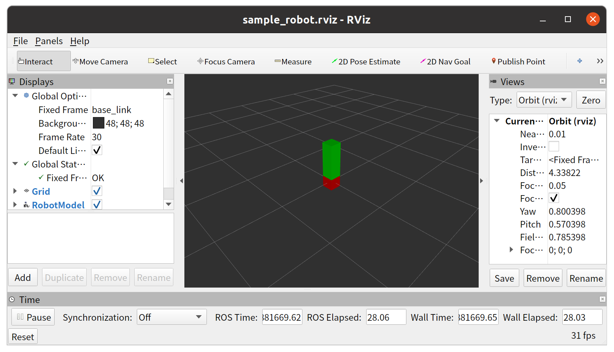
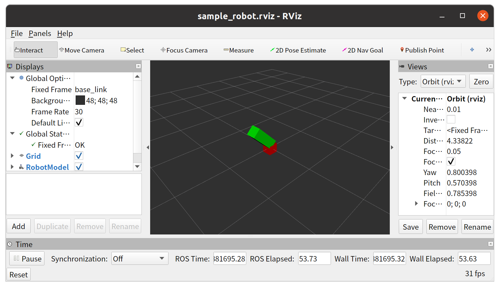
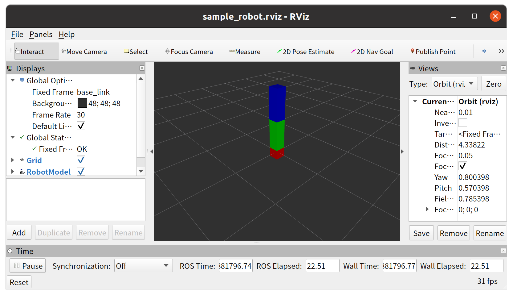
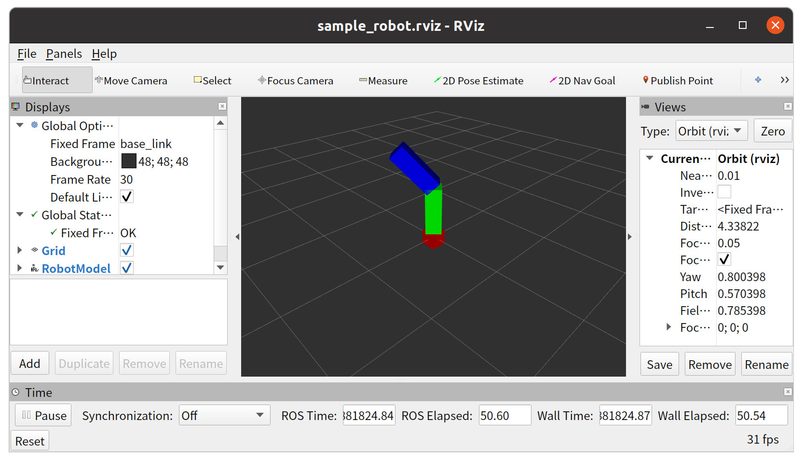

# dynamixel_general_hw

General ros_control layer for Dynamixel actuators. With this layer, you can load [ros_control](http://wiki.ros.org/ros_control) controllers (e.g., [joint_trajectory_controller](http://wiki.ros.org/joint_trajectory_controller)) and make the actuators follow commands from those controllers.

## Samples

### Sample 1: simplest situation

This sample assumes that one bare Dynamixel actuator whose ID and baud rate are `1` and `57600` is connected via the port `/dev/ttyUSB0`.
You can change the baud rate and the port via roslaunch arguments.

```bash
roslaunch dynamixel_general_hw sample1.launch port_name:=/dev/ttyUSB0 baud_rate:=57600
# If you face an error about Operating_Mode, please change the actuator mode to "Joint Mode" by yourself and execute the following:
# roslaunch dynamixel_general_hw sample1.launch port_name:=/dev/ttyUSB0 baud_rate:=57600 protocol_1_0:=true
```

You will see the following RViz window showing a virtual robot synchronized with the real actuator:
<div align="left">

</div>

You can move the actuator by sending a command via `/sample_robot/position_joint_trajectory_controller/follow_joint_trajectory` action.
To try sending a command,
1. Type
   ```bash
   rostopic pub /sample_robot/position_joint_trajectory_controller/follow_joint_trajectory/goal
   ```
   and enter `Tab` three times.
2. Rewrite `time_from_start` and `positions` of the auto-completed output as you want
3. Type `sample_joint` into the empty string following `joint_names` of the auto-completed output

For example, if you send a command like:
```bash
rostopic pub /sample_robot/position_joint_trajectory_controller/follow_joint_trajectory/goal control_msgs/FollowJointTrajectoryActionGoal "header:
  seq: 0
  stamp:
    secs: 0
    nsecs: 0
  frame_id: ''
goal_id:
  stamp:
    secs: 0
    nsecs: 0
  id: ''
goal:
  trajectory:
    header:
      seq: 0
      stamp:
        secs: 0
        nsecs: 0
      frame_id: ''
    joint_names:
    - 'sample_joint'
    points:
    - positions: [0.78]
      velocities: [0]
      accelerations: [0]
      effort: [0]
      time_from_start: {secs: 10, nsecs: 0}
  path_tolerance:
  - {name: '', position: 0.0, velocity: 0.0, acceleration: 0.0}
  goal_tolerance:
  - {name: '', position: 0.0, velocity: 0.0, acceleration: 0.0}
  goal_time_tolerance: {secs: 0, nsecs: 0}"
```
you will get the following final state:
<div align="left">

</div>

Note that this commanding method is only for checking on command line.
Please use [actionlib](http://wiki.ros.org/actionlib) when you write a code.

#### Configuration files

When you read the contents of `sample1.launch`, you will notice that there are three configuration files:

- `$(find dynamixel_general_hw)/urdf/sample1.urdf`

  URDF of the virtual robot.
  This describes the structure of that robot and the relationship between the joint of that robot and the real actuator.
  Because [ros_control](http://wiki.ros.org/ros_control) controllers are joint-level, that relationship is required to control that actuator via those controllers.

- `$(find dynamixel_general_hw)/config/sample1_2/dynamixel_info.yaml`

  Configuration file for the target Dynamixel actuator.
  This describes the name of the target actuator and its initial configuration.

- `$(find dynamixel_general_hw)/config/sample1_2/default_controllers.yaml`

  Configuration file for [ros_control](http://wiki.ros.org/ros_control) controllers.

Please check those files to learn how you can configure dynamixel_general_hw.
Following samples also provide different examples of the configuration files.

### Sample 2: with mechanical reduction and joint offset

This sample assumes that one bare Dynamixel actuator whose ID and baud rate are `1` and `57600` is connected via the port `/dev/ttyUSB0`.
You can change the baud rate and the port via roslaunch arguments.

```bash
roslaunch dynamixel_general_hw sample2.launch port_name:=/dev/ttyUSB0 baud_rate:=57600
# If you face an error about Operating_Mode, please change the actuator mode to "Joint Mode" by yourself and execute the following:
# roslaunch dynamixel_general_hw sample2.launch port_name:=/dev/ttyUSB0 baud_rate:=57600 protocol_1_0:=true
```

You will see the following RViz window showing a virtual robot synchronized with the real actuator:
<div align="left">

</div>

By launching after making the actuator position the same as Sample 1, you will notice that the joint position has an offset in comparison with Sample 1.
In addition, by sending some commands, you will notice there is a reduction between the real actuator and the virtual joint on RViz.

### Sample 3: multiple actuators

This sample assumes that two bare Dynamixel actuators whose IDs and baud rate are `1`, `2`, and `57600` are connected via the port `/dev/ttyUSB0`.
You can change the baud rate and the port via roslaunch arguments.

```bash
roslaunch dynamixel_general_hw sample3.launch port_name:=/dev/ttyUSB0 baud_rate:=57600
# If you face an error about Operating_Mode, please change the actuator mode to "Joint Mode" by yourself and execute the following:
# roslaunch dynamixel_general_hw sample3.launch port_name:=/dev/ttyUSB0 baud_rate:=57600 protocol_1_0:=true
```

You will see the following RViz window showing a virtual robot synchronized with the real actuators:
<div align="left">

</div>

For example, if you send a command like:
```bash
rostopic pub /sample_robot/position_joint_trajectory_controller/follow_joint_trajectory/goal control_msgs/FollowJointTrajectoryActionGoal "header:
  seq: 0
  stamp:
    secs: 0
    nsecs: 0
  frame_id: ''
goal_id:
  stamp:
    secs: 0
    nsecs: 0
  id: ''
goal:
  trajectory:
    header:
      seq: 0
      stamp:
        secs: 0
        nsecs: 0
      frame_id: ''
    joint_names: ['sample_pan_joint', 'sample_tilt_joint']
    points:
    - positions: [-0.78, 0.78]
      velocities: []
      accelerations: []
      effort: []
      time_from_start: {secs: 10, nsecs: 0}
  path_tolerance:
  - {name: '', position: 0.0, velocity: 0.0, acceleration: 0.0}
  goal_tolerance:
  - {name: '', position: 0.0, velocity: 0.0, acceleration: 0.0}
  goal_time_tolerance: {secs: 0, nsecs: 0}"
```
you will get the following final state:
<div align="left">

</div>

### Sample 4: velocity control

This sample assumes that one bare Dynamixel actuator whose ID and baud rate are `1` and `57600` is connected via the port `/dev/ttyUSB0`.
You can change the baud rate and the port via roslaunch arguments.

```bash
roslaunch dynamixel_general_hw sample4.launch port_name:=/dev/ttyUSB0 baud_rate:=57600
# If you face an error about Operating_Mode, please change the actuator mode to "Wheel Mode" by yourself and execute the following:
# roslaunch dynamixel_general_hw sample4.launch port_name:=/dev/ttyUSB0 baud_rate:=57600 protocol_1_0:=true
```

You can move the actuator by sending a command via `/sample_robot/joint_group_velocity_controller/command` topic.
For example, if you send a command like:
```bash
rostopic pub /sample_robot/joint_group_velocity_controller/command std_msgs/Float64MultiArray "layout:
  dim:
  - label: ''
    size: 0
    stride: 0
  data_offset: 0
data:
- 1"
```
you will see the actuator rotates in 1 rad/s.
You can check the real velocity by `rostopic echo /sample_robot/joint_states`.
(Although those interfaces are joint-level, the joint equals the actuator in this sample.)

### Sample 5: effort (torque) control

This sample assumes that one bare Dynamixel actuator whose ID and baud rate are `1` and `57600` is connected via the port `/dev/ttyUSB0`.
You can change the baud rate and the port via roslaunch arguments.

```bash
roslaunch dynamixel_general_hw sample5.launch port_name:=/dev/ttyUSB0 baud_rate:=57600
# If you face an error about Operating_Mode or a warning that effort command to your actuator model is currently not supported, current dynamixel_general_hw does not support effort control of your actuator model.
# Your contribution is welcome
```

You can move the actuator by sending a command via `/sample_robot/joint_group_effort_controller/command` topic.
For example, if you send a command like:
```bash
rostopic pub /sample_robot/joint_group_effort_controller/command std_msgs/Float64MultiArray "layout:
  dim:
  - label: ''
    size: 0
    stride: 0
  data_offset: 0
data:
- 0.1"
```
you will see the actuator outputs 0.1 Nm.
You can check the output effort by `rostopic echo /sample_robot/joint_states`.
(Although those interfaces are joint-level, the joint equals the actuator in this sample.)  

Note that this effort value is realistic only when `torque_constant` in `dynamixel_info.yaml` is well-configured.
If you want the actuator to output the exact effort you command, you may have to prepare your own `dynamixel_info.yaml` and pass it to `dynamixel_general_control.launch`.  
In addition, if you command a big effort, the actuator vibrates because its velocity sometimes violates the velocity limit defined in URDF and the effort command is overwritten to zero.
If you want to avoid this vibration, you should prepare your own URDF having a well-configured velocity limit and pass it to `dynamixel_general_control.launch`.

### Sample 6: using "Current-based Position Control Mode" of Dynamixel

This sample assumes that one bare Dynamixel actuator whose ID and baud rate are `1` and `57600` is connected via the port `/dev/ttyUSB0`.
You can change the baud rate and the port via roslaunch arguments.

```bash
roslaunch dynamixel_general_hw sample6.launch port_name:=/dev/ttyUSB0 baud_rate:=57600
# If you face an error about Operating_Mode or a warning that effort command to your actuator model is currently not supported, current dynamixel_general_hw does not support Current-based Position Control Mode of your actuator model.
# Your contribution is welcome
```

You can move the actuator by:
1. sending an effort command via `/sample_robot/joint_group_effort_controller/command` topic
2. sending a position command via `/sample_robot/position_joint_trajectory_controller/follow_joint_trajectory` action

For example, if you send commands like:
```bash
rostopic pub /sample_robot/joint_group_effort_controller/command std_msgs/Float64MultiArray "layout:
  dim:
  - label: ''
    size: 0
    stride: 0
  data_offset: 0
data:
- 0.1"
```
```bash
rostopic pub /sample_robot/position_joint_trajectory_controller/follow_joint_trajectory/goal control_msgs/FollowJointTrajectoryActionGoal "header:
  seq: 0
  stamp:
    secs: 0
    nsecs: 0
  frame_id: ''
goal_id:
  stamp:
    secs: 0
    nsecs: 0
  id: ''
goal:
  trajectory:
    header:
      seq: 0
      stamp:
        secs: 0
        nsecs: 0
      frame_id: ''
    joint_names:
    - 'sample_joint'
    points:
    - positions: [1.0]
      velocities: [0]
      accelerations: [0]
      effort: [0]
      time_from_start: {secs: 1, nsecs: 0}
  path_tolerance:
  - {name: '', position: 0.0, velocity: 0.0, acceleration: 0.0}
  goal_tolerance:
  - {name: '', position: 0.0, velocity: 0.0, acceleration: 0.0}
  goal_time_tolerance: {secs: 0, nsecs: 0}"
```
you will see the actuator moves to the commanded position (1.0 rad) with limited effort (<= 0.1 Nm).
You can check the real effort by `rostopic echo /sample_robot/joint_states`.
(Although those interfaces are joint-level, the joint equals the actuator in this sample.)

## Launch files

### dynamixel_general_control.launch

A launch file to run the ros_control layer. Launch it when Dynamixel actuators are connected to your PC.

#### Arguments

Check them by `roslaunch dynamixel_general_hw dynamixel_general_control.launch --ros-args`.

#### Minimal publishing topics

- `$(arg namespace)/dynamixel_general_control/dynamixel_state` (`dynamixel_general_hw/DynamixelStateList`)

  States of the connected actuators.

#### Minimal subscribing topics

- `$(arg namespace)/dynamixel_general_control/servo` (`std_msgs/Bool`)

  Servo ON/OFF signal. You can use this to implement an emergency stop function.
  Servo OFF resets other special states (i.e., `hold_position`).

- `$(arg namespace)/dynamixel_general_control/hold_position` (`std_msgs/Bool`)

  When this is `true`, the actuators hold their current positions regardless of commanded positions.
  You can also use this to implement an emergency stop function.  
  Note that if you use effort (torque) control or "Current-based Position Control Mode", the actuators become servo OFF for a moment before holding their positions.
  If this behavior is unacceptable to your application, avoid using this topic.

#### Minimal services

- `$(arg namespace)/dynamixel_general_control/dynamixel_command` (`dynamixel_workbench_msgs/DynamixelCommand`)

  Direct command to Dynamixel control table. This is the same as [/dynamixel_command service on dynamixel_workbench](https://emanual.robotis.com/docs/en/software/dynamixel/dynamixel_workbench/#controllers).
